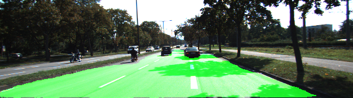
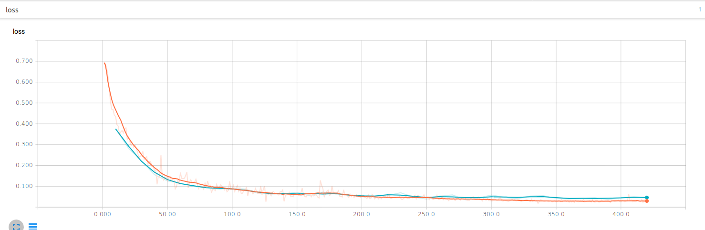
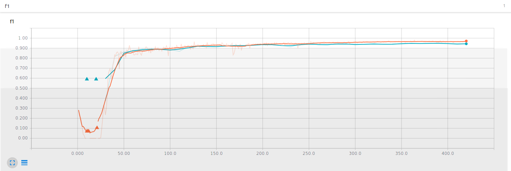
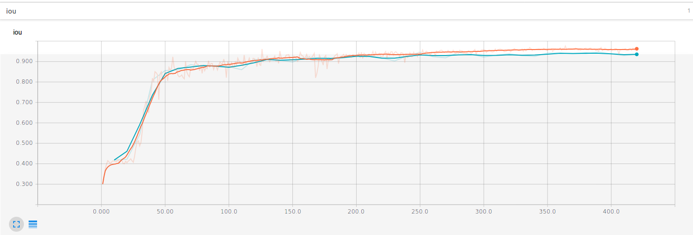
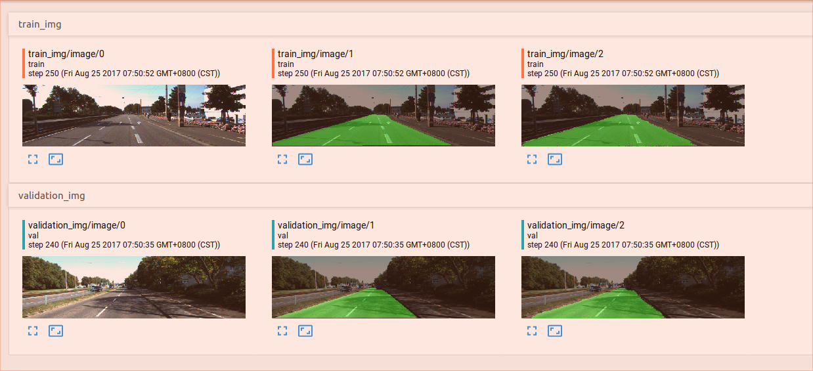
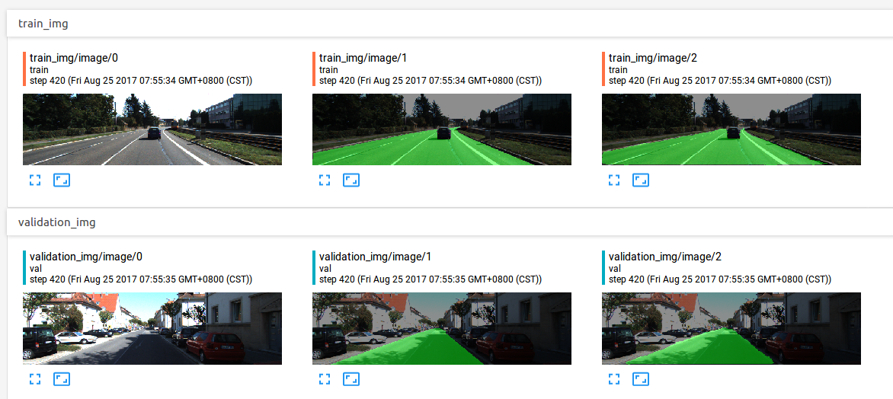

# Semantic Segmentation  

Self-Driving Car Engineer Nanodegree Program  

## Overview   
In this project, we'll label the pixels of a road in images using a Fully Convolutional Network (FCN), busing the approach described in this [paper](https://people.eecs.berkeley.edu/~jonlong/long_shelhamer_fcn.pdf)by Jonathan Long et al.   

The dataset we used is the [Kitti Road dataset](http://www.cvlibs.net/datasets/kitti/eval_road.php), and we adapt contemporary classification networks vgg16 into fully convolutional networks and transferred their learned representation by fining tot eh segmentation task.  


## Final Result  

The result achieved by this implementation is close to the result obtained by [state of the art](http://www.cvlibs.net/datasets/kitti/eval_road_detail.php?result=a26bd8f871c445ebaaec19289ec4825aff66b82b) on the kitti dataset. F1 metrics on validation dataset is 0.94, and IOU is 0.93. Below are a few examples of segmentation result on the test dataset.  





## Neural Network Training Checklist

### Does the project train the model correctly?  

To effectively track/analyze the training process, the training dataset is split into two parts, training dataset and validation dataset, and the ratio is 9:1 as we have only 289 training images in total. After the dataset is split, we can then track the training metrics (like cross entropy loss, IOU, f1) for both data splits, which allow us to determine the variance/bias of the model and take corresponding measures to improve the model/training.  

Below are the loss, f1 and IOU charts generated by tensorboard tool.  





To gain more insight into the connection between mathematical metrics and human perception, we also tracked the segmentation results during the training iteration.  




### Does the project use reasonable hyperparameters?  

I am using a relatively powerful GPU, GTX 1080, so have the luxury of using a large batch size 20, the same as the one used in the original paper. As for the number of epochs, 30 epochs appears to be a good choice based on the above loss/f1/iou charts.  

The whole trainng process can be completed within 15 minutes.  

### Does the project correctly label the road?  

Inference images on the test dataset are stored under folder test_output.  

As mentioned above, F1 metrics on validation dataset is 0.94, and IOU is 0.93. We can't really obtain the metrics on test dataset since we don't have the ground truth label for test dataset. However, the visual effect looks to be quite good.  


## Reflections  

Two interesting issues in this project are observed in this project.  

* Weight initialization  

The training turns out to be quite sensitive to the weight initialization. Using the tf.contrib.layers.xavier_initializer() initializer, the model won't converge at all. In my experimentation, there are two approaches to fix this issue. One way is to try out weights in different ranges with tf.truncated_normal_initializer, and the other is to use batch normalization. After adding batch normalization layer, the model can converge well with Xavier weight initializer. At the end, we use the first approach, as the model converges faster with that approach.  


* Model bias  

This is an open issue for now. Currently the f1 metrics on training dataset is only 0.96. I think we can probably boost the model performance by pushing it a bit higher, maybe to 0.99. There are several tricks we could experiment to achieve this goal.  
1. Use more complex classification layer like resnet to replace vgg16.    
2. Add non-linearity computation into the FCN upsampling layers  
3. Train longer  


## Setup
### Frameworks and Packages
Make sure you have the following is installed:
 - [Python 3](https://www.python.org/)
 - [TensorFlow](https://www.tensorflow.org/)
 - [NumPy](http://www.numpy.org/)
 - [SciPy](https://www.scipy.org/)
 
### Dataset
Download the [Kitti Road dataset](http://www.cvlibs.net/datasets/kitti/eval_road.php) from [here](http://www.cvlibs.net/download.php?file=data_road.zip).  Extract the dataset in the `data` folder.  This will create the folder `data_road` with all the training a test images.


## Run
Run the following command to run the project:
```
python main.py
```
